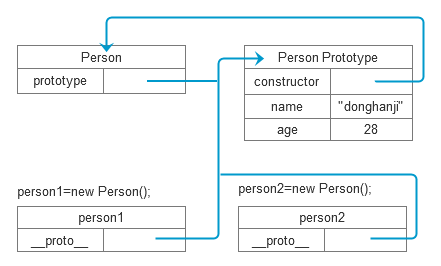

# JS筆記

## 不使用node prefix 執行 nodejs 程式

建立一個mycli.js檔案，內容為

```js
console.log("Hi");
//Hi
```

一般要執行nodejs程式時需要輸入

```bash
node mycli.js
```

為了可以不使用node prefix我們需要在檔案最一開始加入 <code>#! /usr/bin/env node</code>

```js
#! /usr/bin/env node
console.log("Hi");
```

然後創立一個bin資料夾，然後將程式移入，接著在 package.json 中加入 bin 選項

```json
{
  "bin": {
    "mycli": "./bin/mycli.js"
  }
}
```

我們設定執行<code>mycli</code>時執行<code>./bin/mycli.js</code>

接著執行

```sh
npm link
```

現在試試看執行

```sh
mycli
```

就可以看到輸出 mycli.js的執行內容

## 立即函數
在許多框架的原始碼中常常看見這種寫法，函數會在啟動時立刻執行，優點是可以不用擔心污染全域變數，變數生命週期只存在於函數內

寫法如下：

```javascript
(function(){   
  //code
})();
```

也可以丟給他變數

```javascript
(function(word){   
  console.log(word);  //Hi
})("Hi");
```

## Promise

### Promise物件基本使用

```javascript

var someWork = new Promise(function(resolve,reject) {
  // 成功時
  resolve(value);
  // 失敗時
  reject(err);
});

someWork.then(function(value) {
  // resolve發生時執行
  console.log(value);
}).catch(function (err){
  // reject發生時執行
  console.log(err);
});

```

#### Example

簡單的promise範例，模擬取得post在找到對應的user的情況，不使用promise的結果如下：

```javascript

var posts = [{
  user_id: '1',
  title: 'Title',
  content: 'contentcontent'
}];

var users = [{
  id: '1',
  name: 'Name'
}]

function getPosts(callback) {
  setTimeout(function () {
    callback(posts);
  }, 1000);
}

function getUsers(callback) {
  setTimeout(function () {
    callback(users)
  }, 1000);
}

getPosts(function(posts){
    console.log(posts);
  getUsers(function(users){
    console.log(users);
  });
});

```

這樣函數一多會形成 callback hell，所以改用 promise， promise 的作法如下，

函數結束時 return 一個 promise 物件，之後透過 then 來連接，

範例中程式執行的流程會先執行 getPosts ，然後最後將要回傳的 post 結果丟給 resolve，

接著從then取得post的內容，如果在 then 中又 return 一個 promise 物件就可以繼續一直接著 then 下去

```js

var posts = [{
  user_id: '1',
  title: 'Post 1',
  content: 'fake content'
}];

var users = [{
  id: '1',
  name: 'Name'
}]

function getPosts() {
  return new Promise(function (resolve,reject) {
    setTimeout(function () {
      resolve(posts);
    }, 1000);
  });
}

function getUsers() {
  return new Promise(function (resolve,reject) {
    setTimeout( function() {
      resolve(users);
    }, 1000);
  });
}

getPosts().then(function(posts){
    console.log(posts);
    return getUsers();
  })
  .then(function (users) {
    console.log(users);
  }).catch(function(err){
    console.log(err);
  });

```

### Promise.resolve && Promise.reject

```js

function test(val) {
  if(val){
    return Promise.resolve("Success");
  }else{
    return Promise.reject("Fail");
  }
}

test(1).then(function(result){
  console.log(result); //當Resolve發生時執行,Success
}).catch(function(err){
  console.log(err)     //當Reject發生時執行,Fail
})

```

### Promise.all

接受的參數為一個 promise array ， 會等到 array 內的 function 都執行完才到下一步

```js

var funcA = Promise.resolve(1),
    funcB = Promise.resolve(2),
    funcC = Promise.resolve(3);

Promise.all([funcA, funcB, funcC]).then(function (results) {
    console.log(results);  // [1, 2,3]
}).catch(function(err) {
  console.log(err);
});

```

錯誤處理

```js

var funcA = Promise.resolve(1),
    funcB = Promise.reject(2),
    funcC = Promise.resolve(3);

Promise.all([funcA, funcB, funcC]).then(function (results) {
    // 因為發生reject 不會執行
    console.log(results);
}).catch(function(err) {
  console.log(err); // 2
});

```

重複使用同樣的函數

```js

var id = ['A', 'B', 'C'];
var data = {
  'A': [
    'A1',
    'A2'
  ],
  'B': [
    'B1',
    'B2'
  ],
  'C': [
    'C1'
  ]
}

function getData(id) {
  return new Promise(function(resolve, reject) {
    setTimeout(function() {
      resolve(data[id]);
    }, 3000);
  });
}

var getAll = Promise.all(id.map(getData));

getAll.then(function(val) {
  console.log(val);
})

```

## Async / Await

類似於promise的用法，但可以不用使用 then

node v7.0.0 以上已經內建，但v7.0.0的版本需要使用 flag harmony

```sh
node --harmony app.js
```

```js

var posts = [{
  user_id: '1',
  title: 'Post 1',
  content: 'fake content'
}];

var users = [{
  id: '1',
  name: 'Name'
}]

function getPosts() {
  return new Promise(function (resolve,reject) {
    setTimeout(function () {
      resolve(posts);
    }, 1000);
  });
}

function getUsers() {
  return new Promise(function (resolve,reject) {
    setTimeout( function() {
      resolve(users);
    }, 1000);
  });
}

async function main (){
  var post = await getPosts();
  console.log(posts);
  var user = await getUsers();
  console.log(user);
}

main();

```

## Template string

在字串中插入變數，字串須使用｀包起來

```js

var num = 2;
console.log(`Number ${ num }`); // Number 2

```

## Prototype

prototype 只存在於 constructor function ，

\_\_proto\_\_ 則是出現在所有 object 上

\_\_proto\_\_ 指向物件原型



## Class

```js

//建立一個類別叫Person，每個Person都有一個名字
function Person(name){
    this.name = name;
}

//每個Person都有一個method可以打招呼
Person.prototype.say = function(){
    console.log(`Hi my name is ${this.name}`);
}

//產生一個為Person類別的實例
var me = new Person("Derek");

me.say();   //Hi my name is Derek

me.__proto__ == Person.prototype;   //true
me.__proto__.__proto__ == Object.prototype;   //true
me instanceof Person;   //true

```

### 繼承

```js

//建立一個父類別為Human
function Human(){
}

//Human有一個method用來自我介紹
Human.prototype.introduce = function(){
    console.log(`Hi my name is ${this.name}`);
}

//建立一個子類別為Student
function Student(name){
    this.name = name;
}

//讓Student繼承Human
Student.prototype = Human.prototype;

//或
Student.prototype = Object.create(Human.prototype);

//建立一個Student實例
var me = new Student("Derek");

//使用繼承自父類別的method
me.introduce();   //Hi my name is Derek

```

```js

//建立一個類別叫Student，每個Student都有一個名字跟自己的Skill
function Student(name,skill){
    this.name = name;
    this.skill = skill;
}

//定義一個物件Human，有一個function叫introduce用來自我介紹
var Human = {
    introduce:function(){
        console.log(`Hi,my name is ${this.name}.I can write ${this.skill}!`);
    }
}

//讓Student這個類別繼承Human，使其能夠使用Human類別中的method
Student.prototype = Object.create(Human);

//建立一個Student實例
var me = new Student("Derek","Javascript");

//自我介紹
me.introduce();

```

### ES6 Class

```js

class Person {
  //constructor
  constructor(name) {
    this.name = name;
  }
  //method
  say() {
    console.log("My name is " + this.name);
  }
}

var me = new Person("Derek");

me.say();   //My name is Derek

```

繼承的做法：

```js

class Person {
  constructor(name) {
    this.name = name;
  }
  getA() {
    return this.a;
  }
}

class Student extends Person {
  constructor(name,grade) {
    super(name);
    this.grade = grade;
  }
  say(){
    console.log("Hi my name is " + this.name + "\nI'm in " + this.grade + " grade!");
  }
}

```

### 多型

```js

//父類別
function Shape(w,l) {
  this.width = w;
  this.length = l;
}

//父類別 Method
Shape.prototype.area = function() {
    console.log("Area = "+ this.width * this.length);
};

//子類別
function Cube(w,l,h) {
  Shape.call(this,w,l);    //呼叫父類別 constructor
  this.height = h;
}

//子類別繼承父類別
Cube.prototype = Object.create(Shape.prototype);

//子類別 Method
Cube.prototype.volume = function(){
    console.log("Volume = "+ (this.width * this.length * this.height));
}

//創建一個子類別物件
var bigCube = new Cube(3,4,5);
bigCube.volume();    //60

```

### 創建類別不用使用 new 的做法

範例中創建一個 Counter 類別，有兩個屬性 num1 與 num2，

然後有一個 method sum 用來計算兩個數字的總和，

將 Counter 寫成一般函數，實際創建類別的為 Counter.init，

但是相關的 method 是綁在 Counter 上而非 Counter.init，

所以將 Counter.init 的 prototype 設為 Counter 的 prototype

```javascript

var Counter = function (num1,num2) {
  return new Counter.init(num1,num2);
}

Counter.prototype = {
  'sum': function () {
    console.log(this.num1+this.num2);
  }
}

Counter.init = function (num1,num2) {
  this.num1 = num1;
  this.num2 = num2;
}

Counter.init.prototype = Counter.prototype;

Counter(1,2).sum(); // 3

```

## exports 和 module exports

```js

//A

module.exports = function(){
  console.log("hi");
};

var person = require("./module");
person();

//B

exports.say = function(){
  console.log("hi");
};

var person = require("./module");
person.say();

//C

module.exports.say = function(){
  console.log("hi");
};

var person = require("./module");
person.say();

//D

module.exports = {
  say : function(){
    console.log("hi");
  }
};

var person = require("./module");
person.say();

//E

function say(){
  console.log("hi");
}
say()

//Or

(function(){
    console.log("hi");
}());

require("./module");

```

## 模組化

### 模組匯出

```js
(function () {
    var newModule = {},
    privateVar = 1;
    function privateMethod() {
    }
    newModule.moduleProperty = 1;
    newModule.moduleMethod = function () {
    };
    module.exports = newModule;
}());
```

```js
var newModule = require("./newModule");
newModule.moduleMethod();
```

### 物件擴充

```js
(function(factory){
    module.exports = factory;
}(function(scope){
    scope.say = function(){
        console.log("Hi");
    }
}));
```

```js
var person = {}
require("./module")(person);
person.say();
```

### 引入類別

 ```js
(function(factory){
    module.exports = factory;
}(function(name){
    this.name = name;
}));
```

```js
var Person = require("./Person");
var me = new Person("Derek");
```

## Console

使用console來記錄運行時間

```js
console.time('flag');
doSomething();
console.timeEnd('flag');
//flag: xxxxms
```

## Express

### Send static file

```js
res.sendFile(path.join(__dirname+'/index.html'));  
res.sendFile("index.html",{root: __dirname });
app.use("/",express.static(__dirname));
```

### Error handle

 ```js
 // 500錯誤
 app.use(function (err, req, res, next) {
  console.error(err.stack)
  res.status(500).send('Something broke!')
});

// 404錯誤，要放在所有route的下方
app.get('*', function(req, res, next) {
  res.status(404).send('Page not found');
});
 ```

## Call && Bind && Apply

### Call

可以改變 function 中的 this 物件

```js
var human = {  
  name: "Derek",
  say: function(hobby) {
    console.log(`My name is ${this.name}. I like ${hobby}!`);
  }
}

human.say("movies");  // "My name is Derek. I like movies!"
human.say.call({ name:"John" },"coding"); // "My name is John. I like movies!"
```

### Apply

和Call用法相似，可以改變 function 中的 this 物件，但傳遞的參數為array

```js
var human = {  
  name: "Derek",
  say: function(hobby) {
    console.log(`My name is ${this.name}. I like ${hobby}!`);
  }
}

human.say("movies");  // "My name is Derek. I like movies!"
human.say.apply({ name:"John" },["coding"]); // "My name is John. I like movies!"
```

### Bind

bind 創建了一個新的函數，使用者可以指定 function 中的 this 物件

```js
var human = {  
  name: "Derek",
  say: function(hobby) {
    console.log(`My name is ${this.name}. I like ${hobby}!`);
  }
}

var newFunc = human.say.bind({ name: "John" });

human.say("movies");  // "My name is Derek. I like movies!"
newFunc("coding") // "My name is John. I like coding!"
```

## Fetch

為HTML5的API，與過去的 ajax 一樣被用來做發Request的工作

### GET

```js

fetch('http://api.server',{
  method: 'GET',
  headers: new Headers({
    'Content-Type': 'text/json'
  })
})  
.then(function(response) {
  //處理 response
}).catch(function(err) {
  //處理 error
});

```

### POST

```js

fetch('http://api.server',{
  method: 'POST',
  headers: new Headers({
    'Content-Type': 'text/json'
  }),
  body:{
    data:"value"
  }
})  
.then(function(response) {
  //處理 response
}).catch(function(err) {
  //處理 error
});

```

## Events

```js

var EventEmitter = require('events').EventEmitter;
var event = new EventEmitter();

event.on('eventA', function(arg1, arg2) {
  console.log(`eventA ${arg1} ${arg2}`);
});

event.on('eventB',function() {
  console.log('eventB');
});

event.emit('eventA', 'arg1', 'arg2');
event.emit('eventB');

```

## Process

### Event

```js

//程式結束時觸發
process.on('exit',function(code) => {
  console.log("Process done");
});
//錯誤發生時觸發
process.on('uncaughtException', (err) => {
  console.log("Something wrong");
});
```

### exec && spawn

#### Sync

```js

var spawnSync = require('child_process').spawnSync;

var child = spawnSync('node',['-v']);

//Print command output
console.log(child.stdout.toString());
console.log(child.stderr.toString());

```

```js

var execSync = require('child_process').execSync;

var child = execSync('node -v');

//Print command output
console.log(child.toString());

```

#### Async

```js

var spawn = require('child_process').spawn;

var child = spawn('node',['-v']);

child.stdout.on('data', function(data) {
  console.log(data.toString());
});

child.stderr.on('data', function(err) {
  console.log(err);
});

child.on('close', function(code) {
  console.log(code);
});

```

```js

var exec = require('child_process').exec;

exec('node -v',function(error, stdout, stderr){
  if (error) {
    console.error(`exec error: ${error}`);
    return;
  }
  console.log(`stdout: ${stdout}`);
  console.log(`stderr: ${stderr}`);
});

```

### NPX

過去要使用某些套件，需要透過npm全域安裝才能使用，使用npx指令就可以不用事先安裝就可以執行命令

#### npm > 5.2

已內建

#### npm < 5.2

自行安裝

```sh
npm install -g npx
```

#### Example

過去要使用bower

```sh
npm install -g bower
bower install
```

有了 npx

```sh
npx bower install
```
